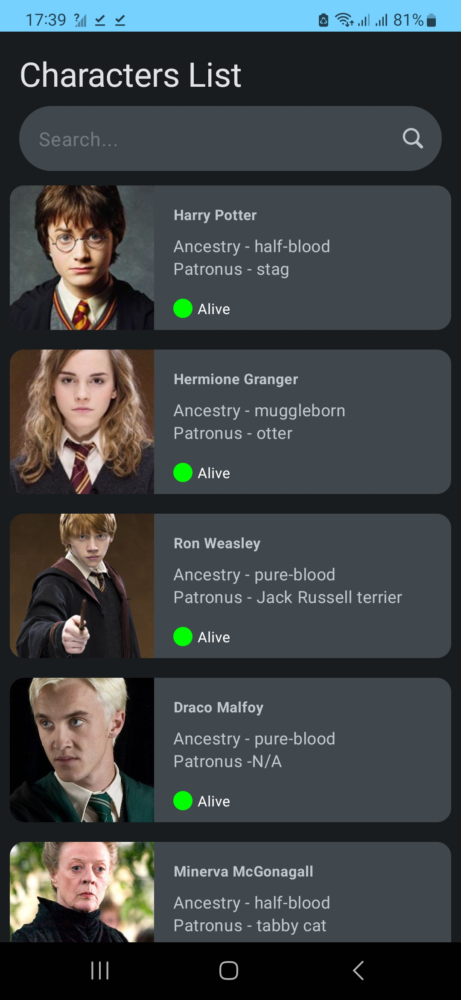
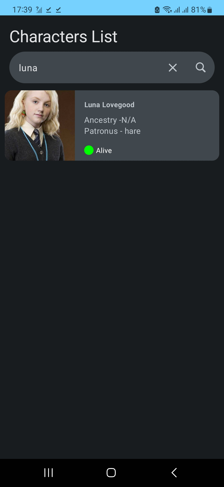
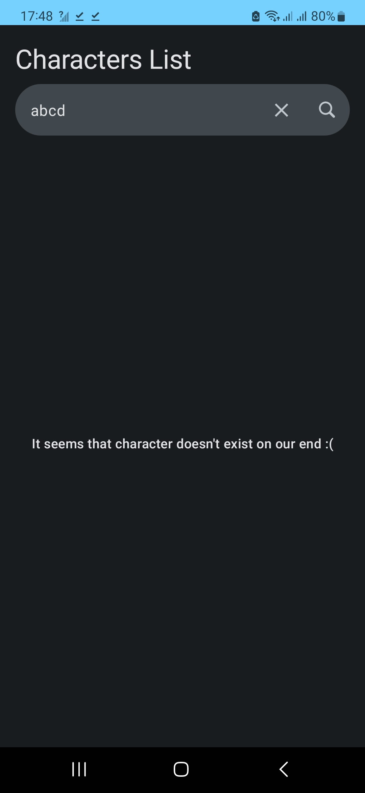

## WezaCare Interview Solution

*Summary*
- This is a Native Android app, that reads data from Rick and Morty [API](https://hp-api.onrender.com/) and displays a list of characters. 

The final app looks like this:👀

  


*Screens*
- **Home Screen**:
    - This screen displays the list of characters with their images and few details on the characters.
    - There's also a search bar where a user can search a character.

- **Details Screen**:
    - When a user clicks on the one character, the user would navigate to the details screen. 
    - Here there's a full description on the selected character.

*Environment*
- Built on A.S Giraffe
- JDK 17

# Design/Architectural decisions 📐

The project makes use of common android patterns in modern android codebases.

**Project Structure**

The folders are split into 4 boundaries:
- **Data**:
  Contains the implementation from the domain layer interface

- **Domain**:

  Contains the data models/interfaces that would be implemented on the data layer

- **DI**:

  This acts as the glue between the data ,domain and presentation.The presentation relies on the domain models and interfaces which are implemented in data.

- **Features**:

  Contains the presentation layer of the app, the screen components and viewmodels. Framework specific dependencies are best suited for this layer.
  In this layer MVI is also used, it looks similar to MVVM but the difference is the actions from a screen a.k.a intents e.g ```LoadLatestCharacters``` are predefined and are finite,making the
  the screen state a bit more predictable and it's easier to scan through what actions are possible from a given screen.

- **DesignSystem**:

  In this layer, its made up of composable widgets and the application theme including(Padding values, Colors) that are reused when making up the composable screens


**Testing**

The data layer is unit tested by mocking out external dependencies and the ui layer on the viewmodels, an integration test
is written that makes use of mocks and Fakes,so as to mimic the real scenario.

## Tech-stack

* Tech-stack
    * [Kotlin](https://kotlinlang.org/) - a cross-platform, statically typed, general-purpose programming language with type inference.
    * [Coroutines](https://kotlinlang.org/docs/reference/coroutines-overview.html) - perform background operations.
    * [Flow](https://kotlinlang.org/docs/reference/coroutines/flow.html) - handle the stream of data asynchronously that executes sequentially.
    * [Jetpack](https://developer.android.com/jetpack)
        * [Flows](https://developer.android.com/kotlin/flow) - is an observable data holder.
        * [ViewModel](https://developer.android.com/topic/libraries/architecture/viewmodel) - store and manage UI-related data in a lifecycle conscious way.
    * [Timber](https://github.com/JakeWharton/timber) - a highly extensible android logger.
    * [Hilt](https://developer.android.com/training/dependency-injection/hilt-android)
    * [Retrofit](https://square.github.io/retrofit/) 
    * [Okhttp](https://square.github.io/okhttp/)
    * [Kotlinx-Serialization](https://kotlinlang.org/docs/serialization.html)

* Architecture
    * MVI - Model View Intent
* Tests
    * [Unit Tests](https://en.wikipedia.org/wiki/Unit_testing) ([JUnit](https://junit.org/junit4/)) - a simple framework to write repeatable tests.
    * [MockK](https://github.com/mockk) - mocking library for Kotlin
    * [Turbine](https://github.com/cashapp/turbine) - A small testing library for kotlinx.coroutines Flow

* Gradle
    * [Gradle Kotlin DSL](https://docs.gradle.org/current/userguide/kotlin_dsl.html) - Alternative syntax from the traditional Groovy
    * Plugins
        * [Ktlint](https://github.com/JLLeitschuh/ktlint-gradle) - creates convenient tasks in your Gradle project that run ktlint checks or do code auto format.
        * [Detekt](https://github.com/detekt/detekt) - a static code analysis tool for the Kotlin programming language.
        * [Spotless](https://github.com/diffplug/spotless) - Adds Licence header.
* CI/CD
    * Github Actions
    * [Fastlane](https://fastlane.tools)

# LICENSE

```
   Copyright 2023 Caleb langat

   Licensed under the Apache License, Version 2.0 (the "License");
   you may not use this file except in compliance with the License.
   You may obtain a copy of the License at

       http://www.apache.org/licenses/LICENSE-2.0

   Unless required by applicable law or agreed to in writing, software
   distributed under the License is distributed on an "AS IS" BASIS,
   WITHOUT WARRANTIES OR CONDITIONS OF ANY KIND, either express or implied.
   See the License for the specific language governing permissions and
   limitations under the License.
   
```